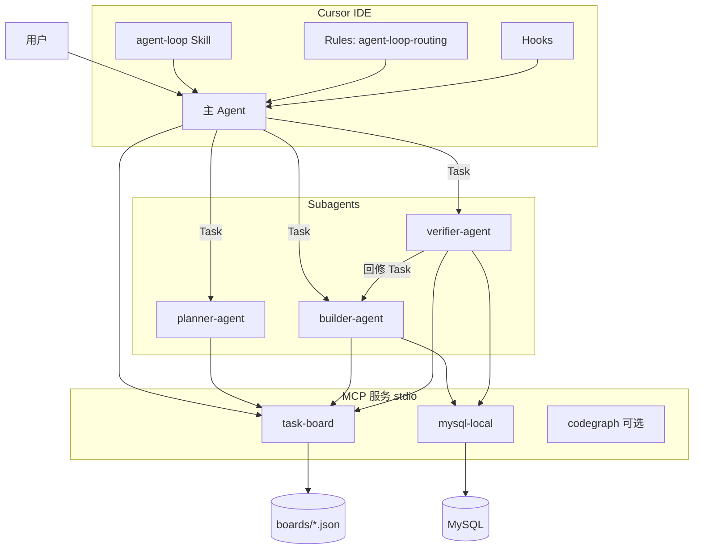

# 三 Agent 架构与 Handoff 协议

**版本**：1.0  
**最后更新**：2026-07-06  

本文档描述 `web_data_analysis_agent` 中 planner / builder / verifier 三 Subagent 的职责边界、输入输出格式、MCP 工具契约及失败处理策略。主 Agent 调度逻辑见 `.cursor/skills/agent-loop/SKILL.md`。

---

## 1. 系统架构



### 1.1 设计原则

| 原则 | 说明 |
|------|------|
| **单一职责** | 每个 Subagent 只做规划、实现或验收之一 |
| **状态外置** | 任务进度写入 task-board，不依赖对话上下文 |
| **只读取数** | 闭环内仅 builder / verifier 调用 mysql-local，且只允许 SELECT |
| **独立验收** | verifier 与 builder 隔离；验收失败由 verifier 驱动回修 |
| **主 Agent 不越权** | 闭环完成前，主 Agent 不得直连 mysql-local 输出报告 |

---

## 2. Agent 职责矩阵

| Agent | 职责 | 触发方 | 可用 MCP | 禁止行为 |
|-------|------|--------|----------|----------|
| **主 Agent** | 识别需求、创建看板、委派 Subagent、向用户交付 | 用户 | task-board | 直连 mysql-local；跳过 verifier |
| **planner-agent** | 拆解任务、定义 acceptance_criteria | 主 Agent | task-board | 查库、写 SQL、输出最终报告 |
| **builder-agent** | 探库、SQL、撰写六节报告 | 主 Agent / verifier-agent | task-board, mysql-local | 跳过 acceptance_criteria；自行调用 verifier |
| **verifier-agent** | 对照 criteria 验收、驱动回修 | 主 Agent | task-board, mysql-local（只读复算） | 修改业务代码或数据库 |

Subagent 定义文件：

- `.cursor/agents/planner-agent.md`
- `.cursor/agents/builder-agent.md`
- `.cursor/agents/verifier-agent.md`

---

## 3. Handoff 协议

### 3.1 标准任务拆分

planner-agent 将分析需求拆为四个任务：

| task_id | 标题 | assignee | 产出 |
|---------|------|----------|------|
| T1 | 确认数据源与字段 | builder-agent | 目标表、时间口径、字段说明 |
| T2 | 执行汇总 SQL | builder-agent | 关键指标与维度表数据 |
| T3 | 撰写分析报告 | builder-agent | 六节完整报告正文 |
| T4 | 独立验收 | verifier-agent | passed / fix_items |

### 3.2 交接时序

```
Phase 0  主 Agent → create_task(requirement=用户原话) → board_id
Phase 1  主 Agent → Task(planner-agent) + board_id
         planner  → assign_task(T1~T3 → builder, T4 → verifier)
         planner  → append_result(T1, 规划 JSON)
Phase 2  主 Agent → Task(builder-agent) + board_id + planner JSON
         builder  → mysql-local 探库/SQL
         builder  → append_result(T1~T3) + complete_task(T1~T3)
Phase 3  主 Agent → Task(verifier-agent) + board_id
         verifier → 对照 criteria，可选 SQL 复算
         verifier → append_result(T4) + complete_task(T4)
Phase 4  主 Agent → 向用户转述 T3 六节报告（verifier passed 后）
```

### 3.3 主 Agent → planner-agent

```
用户需求：<用户原话>
board_id：<create_task 返回的 UUID>
analysis_type：<对比 / 趋势 / 归因 / 分群 / 假设，可选>
```

### 3.4 planner-agent 输出

结构化 JSON，通过 T1 的 `append_result` 写入看板：

```json
{
  "board_id": "<uuid>",
  "project": "分析项目名称",
  "analysis_type": "趋势型",
  "tasks": [
    {
      "task_id": "T1",
      "title": "确认数据源与字段",
      "acceptance_criteria": [
        "明确目标表名",
        "明确时间范围口径",
        "明确金额与去重字段"
      ],
      "assignee": "builder-agent"
    }
  ]
}
```

### 3.5 主 Agent → builder-agent

```
board_id：<uuid>
planner_plan：<planner JSON 或 T1 results 引用>
invoked_by：main-agent | verifier-agent（回修时）
fix_items：[...]（回修时必填）
rework_round：<N>（回修时必填）
```

### 3.6 builder-agent 输出

每个任务的 `append_result.content` 包含：

- 任务 ID 与标题
- 表名、时间口径
- 关键 SQL 或 `reports/` 路径
- T3 完整六节报告正文
- 回修时注明 `rework_round`、`fixed_items`

builder 数据分析规范（来自 `builder-agent.md`）：

- 金额去逗号：`CAST(REPLACE(\`Final Price\`, ',', '') AS DECIMAL(18,2))`
- 日期解析：`STR_TO_DATE(\`Order Date\`, '%d-%m-%Y')`
- 订单数：`COUNT(DISTINCT \`Original Order Number\`)`

### 3.7 主 Agent → verifier-agent

```
board_id：<uuid>
```

verifier 通过 `list_tasks` 读取全部任务与 results。

### 3.8 verifier-agent 输出

```json
{
  "passed": true,
  "summary": "验收摘要",
  "rework_rounds_used": 0,
  "structure_checks": [
    {"section": "1 分析概要", "passed": true, "evidence": "..."}
  ],
  "checks": [
    {"task_id": "T2", "criterion": "产出关键指标汇总", "passed": true, "evidence": "..."}
  ],
  "fix_items": [],
  "report_task_id": "T3"
}
```

轮次用尽仍失败时：`passed: false`，`fix_items` 非空。

---

## 4. MCP 工具契约

实现文件：`src/mcp/task_board_server.py`

| 工具 | 典型调用方 | 说明 |
|------|-----------|------|
| `create_task` | 主 Agent / planner | `board_id` 为空则新建看板，写入 `boards/<uuid>.json` |
| `assign_task` | planner | 任务 status → assigned |
| `append_result` | 全部 Agent | 追加 `results` 数组 |
| `list_tasks` | 全部 Agent | 只读；可传 `board_id` 或列出全部 |
| `complete_task` | builder / verifier | 任务 status → completed |
| `request_rework` | verifier | `rework_rounds` 递增，最多 2 轮（`MAX_REWORK_ROUNDS = 2`） |

合法 assignee：`planner-agent`、`builder-agent`、`verifier-agent`。

### 4.1 看板状态

```
planning → in_progress → done
                    ↘ blocked（验收失败，等待回修）
```

- builder 任务全部 completed 且 T4 completed → `board.status = done`
- verifier 验收失败 → T4 blocked，并记录 `fix_items`
- 回修轮次用尽 → verifier 返回 blocked，主 Agent 向用户说明 fix_items

### 4.2 看板 JSON 结构

```json
{
  "board_id": "uuid",
  "requirement": "用户原始需求",
  "status": "done",
  "rework_rounds": 0,
  "rework_history": [],
  "tasks": [
    {
      "task_id": "T1",
      "title": "...",
      "acceptance_criteria": ["..."],
      "status": "completed",
      "assignee": "builder-agent",
      "results": [
        {"agent": "builder-agent", "content": "...", "timestamp": "..."}
      ]
    }
  ]
}
```

---

## 5. 报告交付规范

T3 报告遵循 `.cursor/skills/agent-loop/report-template.md` 六节结构：

1. 分析概要  
2. 核心结论  
3. 关键指标  
4. 详细分析  
5. 业务建议  
6. 数据说明与局限  

verifier 逐节核对；任一缺失则 `passed: false`。

---

## 6. 失败处理

| 场景 | 处理方式 | 责任方 |
|------|----------|--------|
| planner 产出不清晰 | 补充 criteria 后重跑 planner | 主 Agent |
| builder 未完成任务 | 继续 Task(builder-agent) | 主 Agent |
| verifier 验收失败且轮次未用尽 | `request_rework` → Task(builder-agent) → 重新验收 | verifier-agent |
| 回修轮次用尽 | 主 Agent 说明 fix_items，不强行交付 | 主 Agent |
| mysql-local 连接失败 | builder 在 T1 记录错误；主 Agent 提示检查配置 | builder / 主 Agent |
| 非分析类需求 | 不走 agent-loop，主 Agent 直接处理 | 主 Agent + Rules |

### 6.1 回修循环

由 verifier-agent 在单次 Task 会话内驱动，主 Agent 不介入：

```
verifier 验收 T3
  ├─ passed → complete_task(T4) → 返回主 Agent
  └─ failed → request_rework(fix_items)
       ├─ rework_allowed=false → 返回主 Agent
       └─ rework_allowed=true → Task(builder-agent, fix_items)
            → builder 修复 → verifier 从 list_tasks 重新验收
```

---

## 7. 路由规则

### 7.1 走 agent-loop

`.cursor/skills/agent-loop/SKILL.md` 定义五类分析需求及触发词：

| 类型 | 示例关键词 |
|------|-----------|
| 对比型 | 同比、哪个更好、排名 |
| 趋势型 | 近半年、涨还是跌、销售情况 |
| 归因型 | 为什么下降、什么原因 |
| 分群型 | 客户分几类、用户画像 |
| 假设型 | 如果降价、能不能提升 |

`.cursor/rules/agent-loop-routing.mdc` 强制主 Agent 不得绕过闭环直连 MySQL。

### 7.2 不走 agent-loop

- 写文档、改代码、重构、单元测试
- 配置审查、工具咨询
- 用户明确要求「跳过流程 / 直接查」

---

## 8. Hooks 与审计

`hooks.json` 当前注册：

| Hook | 脚本 | 作用 |
|------|------|------|
| `afterFileEdit` | `after_file_edit.py` | 格式化与编辑日志 |
| `beforeShellExecution` | `before_shell_execution.py` | Shell 危险命令拦截 |
| `beforeMCPExecution` | `before_mcp_execution.py`、`before_mcp_analysis_audit.py` | MCP 调用守卫与 SQL 审计 |
| `beforeSubmitPrompt` | `before_submit_prompt.py`、`before_submit_analysis.py` | 提交前检查与分析意图日志 |

所有 Hook 经 `.cursor/hooks/run_hook.cmd` → `run_hook.py` 启动，共用项目 `.venv`。无 Python 时写入 `hook-debug.log` 并跳过，不阻塞 Cursor。

MCP 经 `scripts/run-mcp.cmd` → `launcher.py` 自举 `.venv`。

日志目录：`.cursor/hooks/logs/`。

---

## 9. 相关文件

| 文件 | 作用 |
|------|------|
| `.cursor/skills/agent-loop/SKILL.md` | 主 Agent 调度步骤 |
| `.cursor/rules/agent-loop-routing.mdc` | 强制路由 |
| `.cursor/rules/guidelines.mdc` | 行为准则与数据库安全 |
| `src/mcp/task_board_server.py` | task-board 实现 |
| `src/mcp/server.py` | mysql-local 实现 |
| `src/mcp/test_integration_d13.py` | 路由与交接集成测试 |

---

## 10. 变更记录

| 版本 | 日期 | 变更 |
|------|------|------|
| 1.0 | 2026-07-06 | 初版 |
