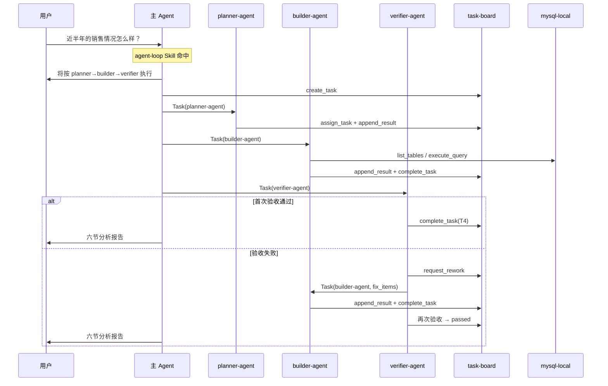

# 项目复盘

**更新日期**：2026-07-06  
**项目**：my_first_agent — 三 Agent 协作数据分析闭环  
**关联测试**：[integration-test-report.md](./integration-test-report.md)

---

## 1. 项目目标

实现一条可重复、可审计的数据分析协作链路：

> 用户提需求 → planner 拆解 → builder 取数写报告 → verifier 独立验收 → 失败则回修 → 向用户交付六节报告

---

## 2. 典型使用场景

### 2.1 分析类（走 agent-loop）

**输入示例：**

```
近半年的销售情况怎么样？
```

**实际行为：**

| 步骤 | 执行者 | 关键动作 | 可验证产物 |
|:----:|--------|----------|------------|
| 1 | 主 Agent | 识别趋势型需求，说明走闭环 | 对话说明 |
| 2 | 主 Agent | `create_task` | `boards/<uuid>.json` |
| 3 | planner-agent | 拆分 T1~T4，`assign_task`，`append_result` | 看板含 4 个任务 |
| 4 | builder-agent | `list_tables` → `execute_query` → 六节报告 | T1~T3 completed |
| 5 | verifier-agent | 对照 criteria + SQL 复算 | T4 `passed: true` |
| 6 | 主 Agent | 转述六节报告 | 用户可见交付物 |

**历史运行记录：**

| board_id | 需求 | 终态 | 六节报告 | 备注 |
|----------|------|:----:|:--------:|------|
| `ceddc89f-…` | 分析25年1月的用户画像 | done | ✅ | planner 留痕完整，verifier SQL 复算通过 |
| `5b38c024-…` | 最近半年的销售情况 | done | ⚠️ 旧版五段 | 早期 run；后续已升级为六节模板 |

### 2.2 非分析类（不走 agent-loop）

| 用户输入 | 预期行为 |
|----------|----------|
| 「帮我写 agent-loop 使用说明」 | 主 Agent 直接写文档，不创建看板 |
| 「给 complete_task 加单元测试」 | 主 Agent 直接改代码 |
| 「把 sales_data 改成 salesData」 | 识别为重构，不走闭环 |

集成测试 RT-01 ~ RT-05 覆盖了上述路由场景，详见 [integration-test-report.md](./integration-test-report.md)。

---

## 3. 流程时序



---

## 4. 已实现能力

| 能力 | 实现位置 |
|------|----------|
| 三 Subagent 职责分离 | `.cursor/agents/*.md` |
| task-board MCP（6 个工具） | `src/mcp/task_board_server.py` |
| mysql-local 只读取数 | `src/mcp/server.py` |
| agent-loop 调度 Skill | `.cursor/skills/agent-loop/SKILL.md` |
| 强制路由 Rule | `.cursor/rules/agent-loop-routing.mdc` |
| verifier → builder 回修（最多 2 轮） | `request_rework` + `verifier-agent.md` |
| 六节报告模板与验收 | `report-template.md` + verifier 验收表 |
| 文件编辑 / MCP / 提交前 Hook | `.cursor/hooks/` |
| 集成测试 | `test_integration_d13.py`、`test_task_board.py` |
| 看板持久化 | `boards/`（当前 9 份历史记录） |

---

## 5. 经验总结

### 5.1 有效做法

- **状态外置到 MCP**：task-board 使三 Agent 交接不依赖长对话；重启 Cursor 后仍可 `list_tasks` 续查。
- **Skill + Rule 双约束**：Skill 定义触发场景，Rule 禁止主 Agent 越权查库。
- **验收标准前置**：planner 在 T1~T3 写入 `acceptance_criteria`，verifier 有明确核对清单。
- **回修内聚在 verifier**：回修循环由 verifier 驱动，主 Agent 不参与修复委派，职责清晰。

### 5.2 待改进项

| 编号 | 问题 | 影响 | 建议 |
|------|------|------|------|
| FIX-01 | Hook 对「销售」「看看」假阳性 | 审计日志噪音 | `analysis_common.py` 增加排除规则 |
| FIX-02 | 部分看板 planner 未留痕 | 规划阶段不可追溯 | 新 run 遵循 `planner-agent.md` 要求 |

### 5.3 已解决项

| 问题 | 方案 |
|------|------|
| Hook 未走 `.venv` | `run_hook.cmd` + `run_hook.py` 自举虚拟环境 |
| MCP 依赖手动建 venv | `run-mcp.cmd` + `launcher.py` 自动初始化 |
| 客户机无 Python | `scripts/setup.ps1` / `setup.sh` + 中文安装指引 |
| Shell 拦截未实现 | 新增 `before_shell_execution.py` |

### 5.4 架构演进建议

若从零重建，建议顺序为：

1. 先定 handoff 协议（见 `docs/agent-handoff-protocol.md`），再写 Subagent，避免早期看板结构不一致。
2. Skill 变更时同步维护路由集成测试，修改 description 后立即回归。
3. Hook 与 MCP 共用同一 Python 解释器，减少环境差异。

---

## 6. 后续工作

| 序号 | 事项 | 预期产出 |
|:----:|------|----------|
| 1 | 修复 FIX-01 | 降低 analysis-intent 假阳性 |
| 2 | 端到端人工跑一条趋势分析 | 新 board + 六节报告 |

---

## 7. 结论

项目核心闭环——planner 拆解、builder 实现、verifier 验收、失败回修、六节报告交付——已有代码、配置与 `boards/` 运行记录支撑。剩余工作集中在 Hook 健壮性与环境初始化一致性，不影响闭环的主流程使用。

---

*关联文档：[README.md](../README.md) · [agent-handoff-protocol.md](../docs/agent-handoff-protocol.md)*
