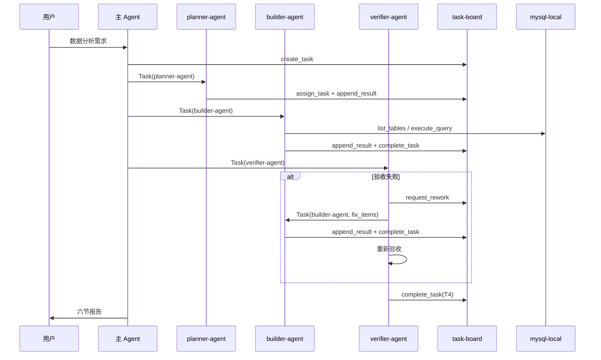

# 集成测试报告

**测试日期**：2026-07-02  
**测试范围**：agent-loop 任务路由 + planner / builder / verifier 三 Agent 交接  
**自动化脚本**：`src/mcp/test_integration_d13.py`  
**执行命令**：`.venv\Scripts\python.exe src\mcp\test_integration_d13.py`

---

## 1. 测试概要

| 指标 | 结果 |
|------|------|
| 自动化用例 | 4 项（路由 5 类 + 失败修复模拟 + 标准交接 + 历史看板审计） |
| 通过 | 4 / 4 |
| 历史看板审计 | 2 / 2 通过 |
| 总体结论 | **基本通过**，存在 Hook 误触发与 planner 记录缺失（见修复清单） |

---

## 2. 任务路由测试

| ID | 类别 | 模拟用户输入 | 应走 agent-loop | 实际路由 | Hook 意图 | 结果 |
|----|------|-------------|:---------------:|:--------:|-----------|:----:|
| RT-01 | 文档类 | 帮我写一份 agent-loop 使用说明文档，介绍 planner、builder、verifier 三个角色的职责分工 | 否 | 否 | 无 | ✅ |
| RT-02 | 代码类 | 给 task_board_server.py 的 complete_task 增加单元测试 | 否 | 否 | 无 | ✅ |
| RT-03 | 失败修复类 | 近半年的销售情况怎么样 | 是 | 是 | 趋势分析（近半年） | ✅ |
| RT-04 | 边界类 | 帮我看看 task-board 的配置结构对不对 | 否 | 否 | ⚠️ 通用分析（看看） | ✅ |
| RT-05 | 误触发类 | 把变量名 sales_data 改成 salesData，这是代码重构不是查销售数据 | 否 | 否 | ⚠️ 通用分析（销售） | ✅ |

### 说明

- **文档类 / 代码类**：Hook 未误报；`agent-loop-routing.mdc` 可正确跳过闭环。
- **失败修复类**：task-board 模拟完整「打回 → 修复 → 再验收」，T4 最终 `passed: true`。
- **边界类 / 误触发类**：路由判定正确，但 `before_submit_analysis` 仍会写入 `analysis-intent.log`（假阳性），实际路由依赖主 Agent 语义判断。

---

## 3. 三 Agent 交接审计

### 3.1 模拟交接

| 步骤 | Agent | MCP 操作 | 结果 |
|------|-------|----------|:----:|
| 1 | 主 Agent | `create_task` | ✅ |
| 2 | planner-agent | `append_result`（规划清单） | ✅ |
| 3 | builder-agent | T1~T3 `append_result` + `complete_task` | ✅ |
| 4 | verifier-agent | T4 `append_result` + `complete_task` | ✅ |
| 5 | 看板终态 | `board_status = done` | ✅ |

失败修复模拟：

| 轮次 | 行为 | 看板状态 |
|------|------|----------|
| 第 1 轮 | verifier 验收 T3 失败，输出 fix_items | T4 blocked |
| 第 2 轮 | builder 补全报告，`complete_task(T3)` | T3 completed |
| 第 3 轮 | verifier 再次验收 `passed: true`，`complete_task(T4)` | board done |

### 3.2 历史看板审计

| board_id | 需求 | 终态 | builder | verifier | planner 留痕 | 结论 |
|----------|------|:----:|:-------:|:--------:|:------------:|:----:|
| `5b38c024-…` | 最近半年的销售情况 | done | T1~T3 ✅ | T4 ✅ | ❌ | 交接有效 |
| `ceddc89f-…` | 分析25年1月的用户画像 | done | T1~T3 ✅ | T4 ✅ | ✅ | 交接完整 |

**观察：**

- 看板 `5b38c024` 的 T3 为旧版五段结构，未严格遵循 `report-template.md` 六节；`ceddc89f` 已对齐六节且 verifier SQL 复算通过。
- 看板 `5b38c024` 的 T1 `acceptance_criteria` 过于笼统；后续 planner 模板已细化。

---

## 4. 交接时序

---

## 5. 修复清单

| 优先级 | 编号 | 问题 | 建议 | 状态 |
|:------:|------|------|------|:----:|
| P1 | FIX-01 | Hook 对「销售」「看看」等词不含语义上下文 | `analysis_common.py` 增加排除规则 | 待修复 |
| P2 | FIX-02 | 部分看板 planner 未 `append_result` | `planner-agent.md` 已要求规划后必须留痕 | 待修复 |
| P2 | FIX-03 | 早期报告未强制六节 | `report-template.md` + verifier 验收表已覆盖 | 已缓解 |
| P3 | FIX-04 | Windows 缺 tzdata 时 Hook 时区报错 | `requirements.txt` 增加 tzdata 或回退时区 | 待修复 |
| P3 | FIX-05 | 极短分析词可能误触发 | `SKILL.md` 补充澄清规则 | 待修复 |

---

## 6. 结论

1. **核心闭环可用**：task-board、三 Agent 分工、回修流程均已验证。
2. **路由规则有效**：文档/代码/误触发类不会错误进入 agent-loop。
3. **Hook 层风险**：`before_submit_analysis` 仅做审计，不能替代路由；FIX-01 可降低日志噪音。

---

*由 `test_integration_d13.py` 自动生成 + 历史看板人工审计*
